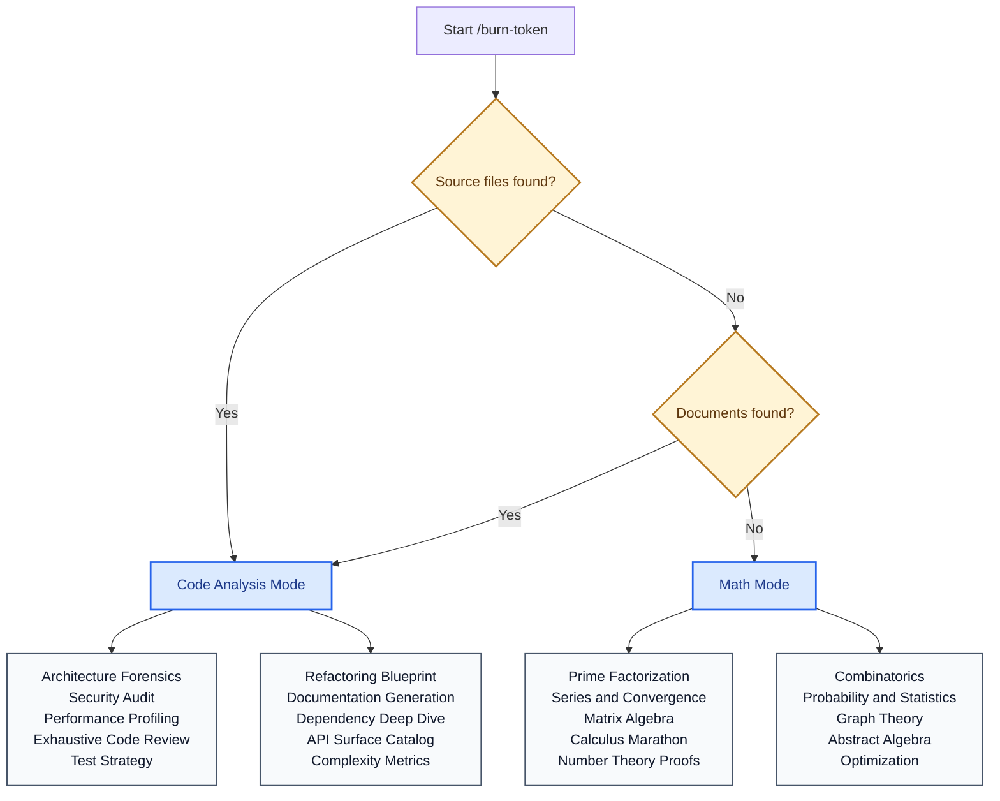

# burn-token 🔥

**Burn your AI coding tokens to the ground.**

[English](./README.md) | [中文](./README.zh-CN.md)

An aggressive token-burning skill for Claude Code / Codex / Claude CLI. It runs an infinite loop of heavyweight analysis and computation, designed to maximize token consumption — even on unlimited plans.

---

## What It Does

| Feature | Description |
|---------|-------------|
| **Auto-detect mode** | Has code? → endless code analysis. Empty project? → hardcore math problems. |
| **Infinite loop** | Runs forever by default. Only stops when you say so (or tokens run out). |
| **KV Cache defeat** | Injects entropy (random seeds, timestamps, shuffled order) into every prompt to prevent cache hits and maximize actual token consumption. |
| **Configurable** | Set time limits, round limits, or let it rip. |
| **Schedulable** | Combine with `/loop` or `/schedule` for automated recurring burns. |

---

## Installation

### Claude Code

```bash
git clone https://github.com/shengxinjing/burn-token.git
cp -r burn-token/skill ~/.claude/skills/burn-token
```

Or manually:

```bash
mkdir -p ~/.claude/skills/burn-token
curl -o ~/.claude/skills/burn-token/SKILL.md \
  https://raw.githubusercontent.com/shengxinjing/burn-token/main/skill/SKILL.md
```

### Codex CLI (OpenAI)

```bash
git clone https://github.com/shengxinjing/burn-token.git
cp -r burn-token/skill ~/.agents/skills/burn-token
```

### Other AI Coding Agents

Place `SKILL.md` in your agent's skill directory:

| Agent | Skill Directory |
|-------|----------------|
| Claude Code | `~/.claude/skills/burn-token/` |
| Codex CLI | `~/.agents/skills/burn-token/` |
| Custom agents | Check your agent's skill loading path |

### Verify Installation

```bash
head -5 ~/.claude/skills/burn-token/SKILL.md
```

You should see the `---` frontmatter with `name: burn-token`.

---

## Usage

### Infinite Burn (default)

```
/burn-token
```

Runs forever. Auto-detects whether to analyze code or do math. `Ctrl+C` to stop.

### Time-Limited

```
/burn-token 1h
/burn-token 30m
/burn-token 4h30m
```

### Round-Limited

```
/burn-token 10 rounds    # 10 rounds = 100 tasks
/burn-token 50 rounds
```

### Force Mode

```
/burn-token math         # force math even if project has code
/burn-token code         # force code analysis
/burn-token 2h math      # combine time limit + mode
```

### Scheduled Burns

```bash
# Burn 45 minutes every hour
/loop 1h /burn-token 45m

# Business hours (Mon-Fri, 9am-5pm)
/schedule create --cron "0 9-17 * * 1-5" --prompt "/burn-token 50m"

# Overnight burn
/schedule create --cron "0 22 * * *" --prompt "/burn-token 8h"

# Every 2 hours around the clock
/schedule create --cron "0 */2 * * *" --prompt "/burn-token 1h45m"
```

---

## How It Works

### Mode Selection



### KV Cache Defeat

Most AI APIs cache repeated prompt prefixes. This skill defeats caching by:

1. **Nanosecond timestamps** — unique prefix every call
2. **Random entropy seed** — from `/dev/urandom`
3. **Shuffled task order** — never the same sequence
4. **Varied prompt phrasing** — different words each time
5. **Rotating output formats** — prose, tables, bullets, Q&A

Every single token is freshly computed, never served from cache.

### Burn Rate Maximization

Each subagent task burns tokens on both input and output:

- **Input:** Reads ALL project files into context (not just relevant ones)
- **Output:** Minimum 2000 words per task with detailed step-by-step analysis
- **No shortcuts:** Line-by-line analysis, multiple verification methods
- **Fresh context:** Each task runs as a new subagent (no context reuse)

---

## Progress Output

During burn:

```
=== BURN TOKEN === Round 1 | Task 3/10 | Elapsed: 0h12m | Est. tokens: ~48K | Seed: 2847193650 ===
=== BURN TOKEN === Round 1 | Task 4/10 | Elapsed: 0h16m | Est. tokens: ~64K | Seed: 1039284756 ===
```

On completion:

```
========================================
  BURN TOKEN COMPLETE
  Rounds:    7
  Tasks:     70
  Duration:  1h 58m 34s
  Mode:      code
  Est. tokens burned: ~1120K
========================================
```

---

## FAQ

**Q: Will this actually burn through a Claude Max plan?**
A: Yes. Claude Max plans have rate limits, not true unlimited tokens. This skill hits those rate limits continuously with cache-defeating entropy.

**Q: Why defeat KV cache?**
A: Cached responses consume fewer compute tokens. By injecting entropy, we force fresh computation every time instead of serving cached KV states.

**Q: Is this safe?**
A: The skill only reads and analyzes — it never modifies files, pushes code, or makes external requests. Read-only by design.

---

## License

MIT
